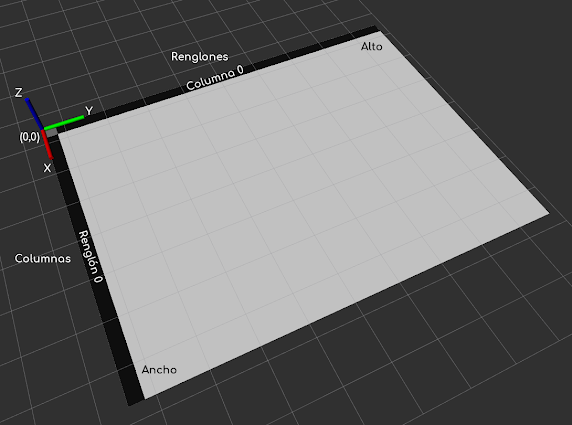
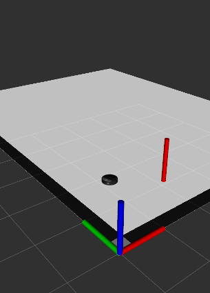

# sim_basics

Ejemplo elemental sobre cómo utilizar una malla de ocupación en ROS (OccupancyGrid). Abajo se muestra una imagen del programa corriendo, con etiquetas añadidas que explican los sistemas de coordenadas.



Se puede clonar dentro del src de cualquier espacio de trabajo de catkin.

Requiere kobuki_softnode y rviz.

Para ejecutar:

```
roslaunch kobuki_softnode full.launch
rosrun rviz rviz
rosrun sim_basics basic_map
roslaunch kobuki_keyop keyop.launch
```

En rviz agregar los elementos siguientes:

* **RobotModel**.
* **Axes**.
* **Marker**.  *Marker topic:* visualization_marker
* **Marker**. *Marker topic:* marca_meta
* **Map**.  *Topic:* occupancy_marker

Si se hace click en el botón *2D Nav Goal* en RViz y luego se selecciona un punto en el mapa,
aparecerá un marcador rojo indicando la coordenada destino.


